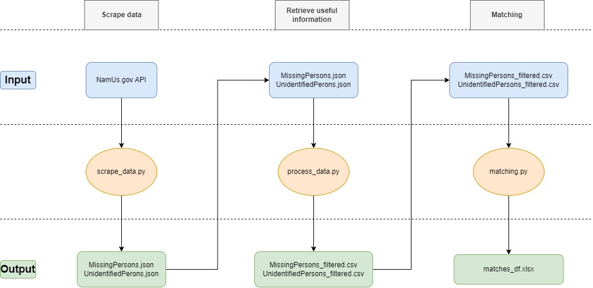

# Missing and Unidentified Persons Matching Project

## Motivation

The idea for this project was inspired by a story featured in [The Times](https://archive.ph/FG948), where an individual used publicly available data and manually matched a missing person to an unidentified individual based on overlapping characteristics such as physical features and personal belongings. This sparked my curiosity about the manual matching process and the possibility of automating it using modern machine learning techniques. Through further research, I discovered an entire community dedicated to solving such cases, particularly on platforms like Reddit. This project aims to aid these efforts by automating the search for potential matches with the help of modern large language models (LLMs).

## Project Overview

This project leverages modern machine learning techniques to analyze and match missing persons to unidentified remains using data from the National Missing and Unidentified Persons System ([NamUs](https://namus.nij.ojp.gov/)). The pipeline combines structured rule-based filtering with LLM-driven textual analysis to increase the likelihood of finding meaningful matches. The process involves:

1. **Data Collection**:  
   Leveraging the NamUs Scraper by Prepager ([GitHub Repository](https://github.com/Prepager/namus-scraper)), the `scrape_data.py` script downloads data for all missing and unidentified persons from NamUs.

2. **Data Processing**:  
   The `process_data.py` script extracts and organizes relevant data from the scraped data, such as demographics, physical features, and other descriptive information.

3. **Matching Algorithm**:  
   The `matching.py` script applies a multi-step approach to find potential matches:  
   - **Must-Match Criteria**: Filters based on immutable attributes like age, sex, ethnicity, and eye color.  
   - **Similarity Scoring**: Uses an exponential decay function to calculate scores for attributes like weight, location, and time.  
   - **LLM-Based Matching**: Employs the Mistral Mixtral 8x7B model to assess the similarity of descriptions for clothing and physical features.

4. **Results**:  
   Matches are saved in an Excel file (`output/matches.xlsx`) with NamUs IDs for both missing and unidentified individuals, along with their overall similarity score and details of individual category scores.

## Call to Action

This project has already demonstrated its potential to aid investigations. During one of the test runs, the algorithm successfully identified a meaningful match between Timothy Lucas ([MP3052](https://www.namus.gov/MissingPersons/Case#/30521/details?nav)) and [UP10830](https://www.namus.gov/UnidentifiedPersons/Case#/10830/details?nav). This match was reported to the authorities for further investigation, underscoring the potential of this tool to assist in resolving real cases and providing closure to families.

You are encouraged to download the `output/matches.xlsx`, explore potential matches with high similarity scores, copy the NamUs IDs, and verify the cases on [NamUs](https://namus.nij.ojp.gov/). If you identify a likely match, please report it to the authorities to assist in resolving these cases.

---

## Additional Information for Developers and Contributors

If you plan to improve or build on this code, here are some additional details to help you understand the project's structure and workflow. This project is structured around three main stages: **Data Scraping**, **Data Processing**, and **Matching**, as visualized in the workflow diagram below. The diagram provides a clear overview of the input, processing scripts, and output for each stage.

### Workflow Breakdown

1. **Scrape Data**:  
   - **Script**: `scrape_data.py` (adapted from [Prepager's NamUs Scraper](https://github.com/Prepager/namus-scraper)) 
   - **Input**: NamUs.gov API  
   - **Output**: Raw JSON files (`MissingPersons.json`, `UnidentifiedPersons.json`)  
   - **Purpose**: Collect raw data about missing and unidentified persons from the NamUs API.  

2. **Retrieve Useful Information**:  
   - **Script**: `process_data.py`  
   - **Input**: Raw JSON files from the scraping stage.  
   - **Output**: Filtered and structured CSV files (`MissingPersons_filtered.csv`, `UnidentifiedPersons_filtered.csv`)  
   - **Purpose**: Extract relevant attributes (e.g., age, physical features, clothing descriptions) and structure them into clean, tabular datasets.  

3. **Matching**:  
   - **Script**: `matching.py`  
   - **Input**: Processed CSV files from the previous stage.  
   - **Output**: Excel file containing matches (`matches_df.xlsx`).  
   - **Purpose**: Identify potential matches using a combination of rule-based filtering and machine learning.  

This modular structure ensures that each stage can be improved or replaced without disrupting the overall pipeline.

---

## Role of the Large Language Model (LLM)

A key innovation of this project is its use of an LLM to enhance the matching process by providing textual comparisons for:

- **Clothing Descriptions**: Analyzing details about the type, color, or style of garments.  
- **Physical Features**: Evaluating unique identifiers like tattoos, scars, or other notable characteristics.  

To select the most suitable LLM, I manually labelled a dataset, available in the `test_data` folder. This dataset consists of 50 pairs of clothing descriptions and 50 pairs of physical feature descriptions, each rated for similarity on a scale of 1 to 5. This benchmark was used to evaluate the performance of multiple models in terms of accuracy and efficiency.

After testing multiple LLMs, the **Mistral Mixtral-8x7B-Instruct-v0.1** model was chosen. It achieved the best balance between inference speed and scoring accuracy, making it an ideal choice for this task. The model compares pairs of descriptions using a structured prompt and generates a similarity score, which is then integrated with the rule-based scores for a comprehensive matching result.

### Hardware Details

The LLM computations were performed on the [BwUniCluster 2.0](https://wiki.bwhpc.de/e/BwUniCluster2.0), a high-performance computing (HPC) cluster provided by my university. The model was executed on a **NVIDIA Tesla V100 GPU** with **32 GB of memory**, ensuring efficient processing of the LLM tasks.

---

## Suggestions for Improvement

This project serves as a foundation for exploring automated matching of missing and unidentified persons. Below are several ideas for enhancing its capabilities:

- **Expand Attribute Matching**:  
   Incorporate additional techniques such as facial recognition to compare photographs of missing persons and unidentified remains, which could significantly improve matching accuracy.

- **Model Performance Optimization**:  
   Experiment with newer models or smaller, more efficient LLMs to reduce computational costs while maintaining high performance, especially for resource-constrained environments.

- **Visualization**:  
   Develop geospatial visualizations to plot matches on a map, enabling easier analysis of location-based similarities and patterns.

- **Parallelization**:  
   Optimize the matching process to run in parallel, particularly for large datasets, to significantly reduce computation time and improve scalability.
